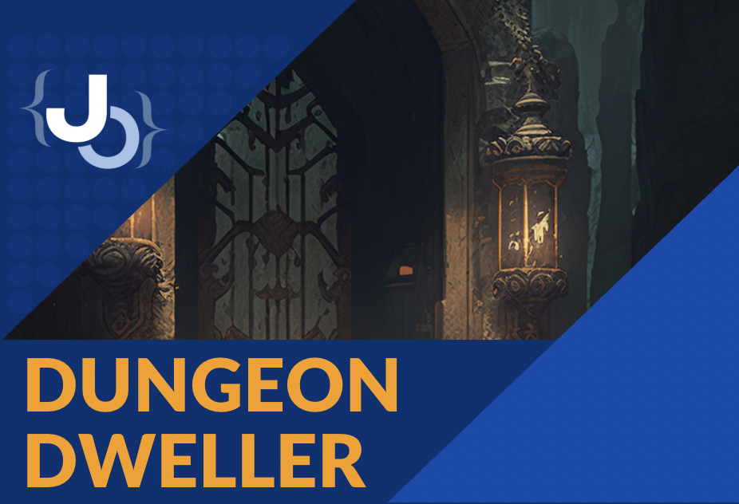

# Dungeon Dweller  

  

Dungeon Dweller is a **console-based adventure game** developed in C++ as my **final project for Term 2** of my **Database Design & Programming class in high school**.  

The project was my first larger C++ program, and it focuses on building fundamental programming concepts like object-oriented design, file handling, and simple game logic.  

---

## Features  
- Console-based gameplay (text interface)  
- Basic dungeon exploration mechanics  
- Menu system for navigating actions  
- Demonstrates use of C++ classes and data structures  

---

## Getting Started  

### Requirements  
- [Visual Studio](https://visualstudio.microsoft.com/) (Community, Professional, or Enterprise)  
- Desktop development with C++ workload installed  

### How to Run in Visual Studio  
1. Clone or download this repository.  
2. Open the solution file `DungeonDweller.sln` in Visual Studio.  
3. Build the solution (`Ctrl + Shift + B`).  
4. Run the program (`Ctrl + F5`).  

---

## Documentation  

📖 [View the Dungeon Dweller Manual (PDF)](Dungeon-Dweller-Manual-Joseph-Davis-Chamdani-10K.pdf)  

---

## Notes  
- This was an educational project made in high school, so the design is intentionally simple.  
- The main focus was applying C++ basics and showing an understanding of programming and problem-solving.  

---

## License  
This project is shared for educational purposes.  

✍️ Created by **Joseph Davis Chamdani**  

